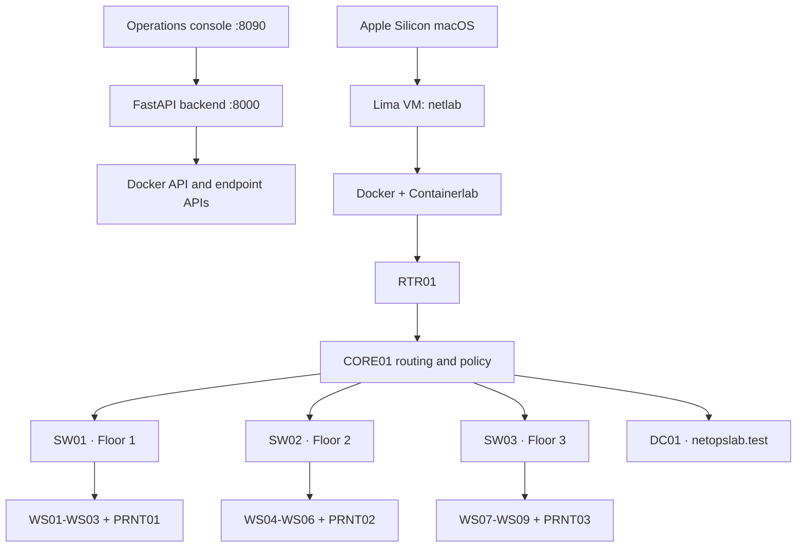

# NetOps Lab

NetOps Lab is a lightweight, interactive small-office infrastructure lab for
practicing monitoring, troubleshooting, fault recovery, and network access
control. It combines real Containerlab links and Linux networking with simulated
workstation and printer services, a safe FastAPI control plane, and a browser
operations console.

## Implemented baseline

- 25 devices: RTR01, CORE01, SW01-SW03, WS01-WS09, LTP01-LTP06, PRNT01-PRNT03, DC01, and FILE01
- three routed floor networks with default-deny inter-floor endpoint access
- reusable workstation and printer containers with live operational state
- printer queues, paper/toner faults, retry, refill, and recovery controls
- infrastructure and endpoint fault injection with dependency-aware impact
- allowlisted ping, reachability, traceroute, DNS, route, neighbor, and service checks
- live dashboard, topology, device details, incident lists, and recent events
- ARM64 Samba AD domain services, DNS, users, groups, and safe account workflows

Inventory and addressing are defined in
[`configs/inventory.json`](configs/inventory.json) and
[`configs/IP_PLAN.md`](configs/IP_PLAN.md).

## Architecture



Containerlab management interfaces remain separate from the three office
subnets. CORE01 routes office traffic and applies the floor access policy. The
backend accepts only inventory hostnames and allowlisted actions; it does not
expose arbitrary shell execution or arbitrary network targets.

## Requirements

- Apple Silicon macOS
- Lima VM named `netlab` with Docker and Containerlab
- approximately 2 CPUs, 4 GB RAM, and 25 GB disk for Lima
- Python 3 on macOS for the static frontend server

Run Docker, Containerlab, backend, and test commands inside Lima.

## Build and run

```bash
limactl shell netlab
cd /path/to/small-office-lab
./scripts/build-images.sh
./scripts/lab.sh deploy
./scripts/lab.sh inspect
```

Inside Lima, start the backend in a separate shell:

```bash
cd /path/to/small-office-lab
python3 -m venv "$HOME/.venvs/netops-lab"
. "$HOME/.venvs/netops-lab/bin/activate"
python3 -m pip install -r backend/requirements.txt
uvicorn backend.app.main:app --host 0.0.0.0 --port 8000
```

On macOS, start the frontend:

```bash
cd /path/to/small-office-lab
python3 -m http.server 8090 --directory frontend
```

Open <http://127.0.0.1:8090>. Direct endpoint pages are published at ports
8080-8083 for PRNT01, WS01, PRNT02, and PRNT03 respectively.

See [`backend/README.md`](backend/README.md) and
[`frontend/README.md`](frontend/README.md) for component details. To remove the
lab, run `./scripts/lab.sh destroy` inside Lima. Runtime artifacts default to
Linux-local `$HOME/containerlab-runtime`, keeping them off the macOS mount.
DC01 state defaults to `$HOME/netops-lab-state/dc01` inside Lima and survives
normal Containerlab destruction and redeployment.

## Validation

```bash
python3 -m pytest -q backend/tests tests
python3 -m py_compile backend/app/*.py backend/app/routes/*.py backend/app/services/*.py containers/printer/*.py containers/workstation/*.py
node frontend/tests/check_frontend.mjs
sh -n scripts/build-images.sh scripts/lab.sh
```

After deployment, verify `/api/health`, `/api/lab`, representative diagnostics,
fault/recovery controls, and the direct endpoint pages.

## Current limitations and future work

- Endpoint runtime state and event history are in memory; DC01 state is persistent.
- Source changes require rebuilding the relevant image and redeploying the lab.
- The local console assumes backend port 8000; authentication and RBAC are not implemented.
- The lab uses routed Linux networks rather than enterprise switch images or VLAN tagging.
- Native Windows Server, domain-joined Windows clients, applied GPOs, file services,
  ITSM, deeper monitoring, automation/remediation, AWS hosting, and multi-user
  security are future work.

## Screenshot

Add a current operations-console screenshot here when preparing the repository
for portfolio publication.
